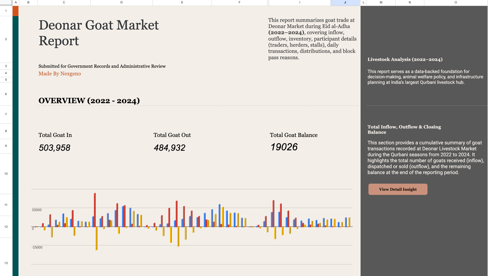
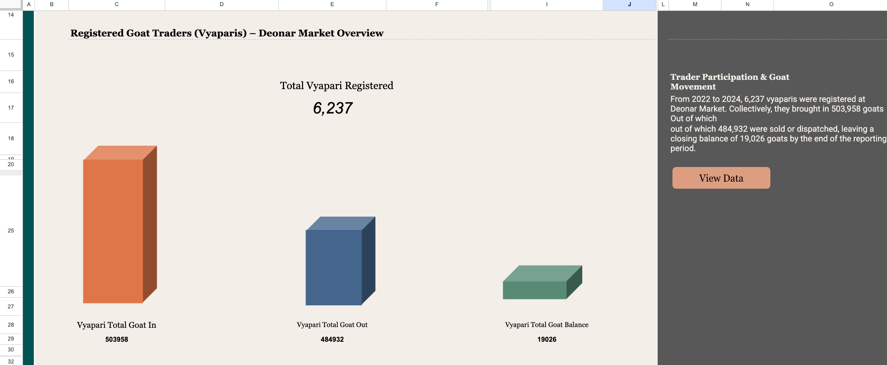
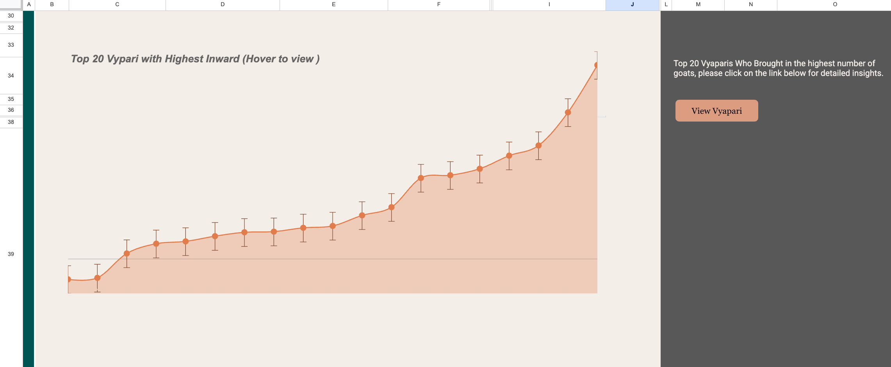
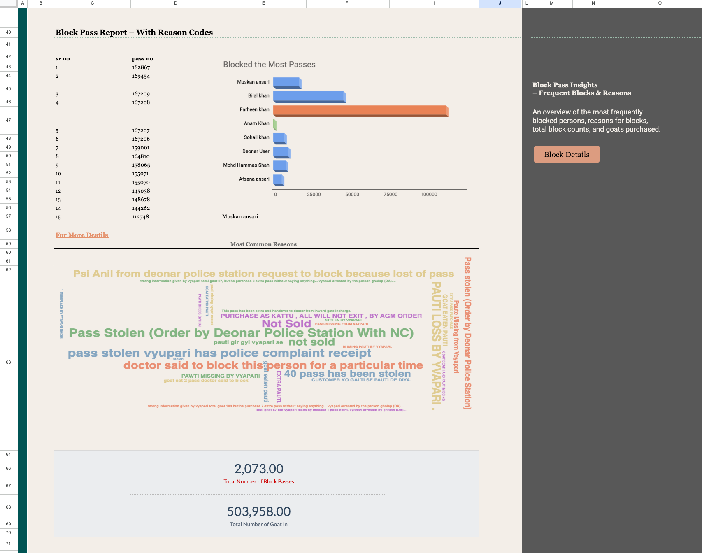
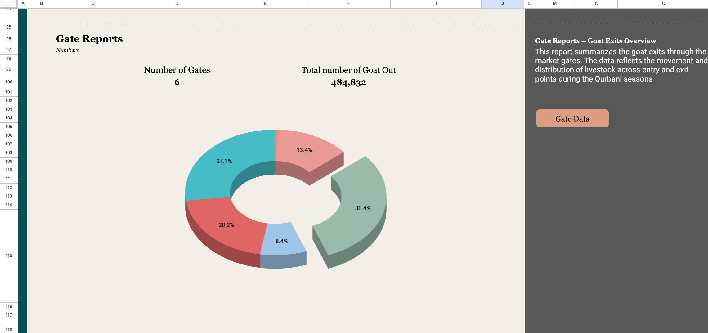
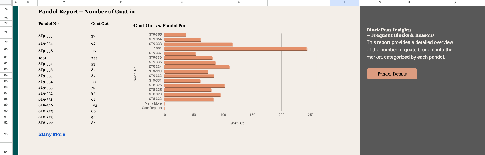
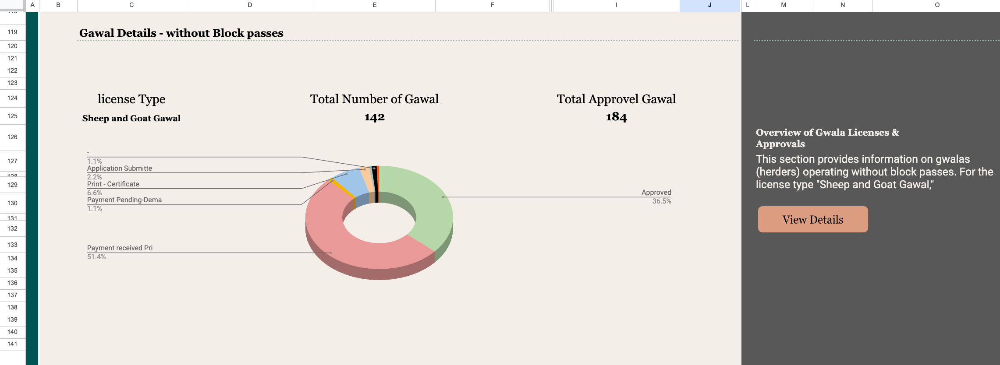
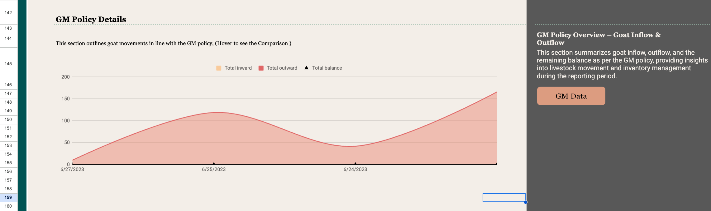
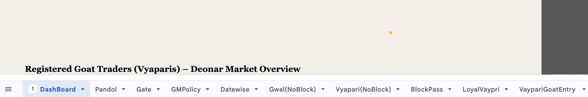
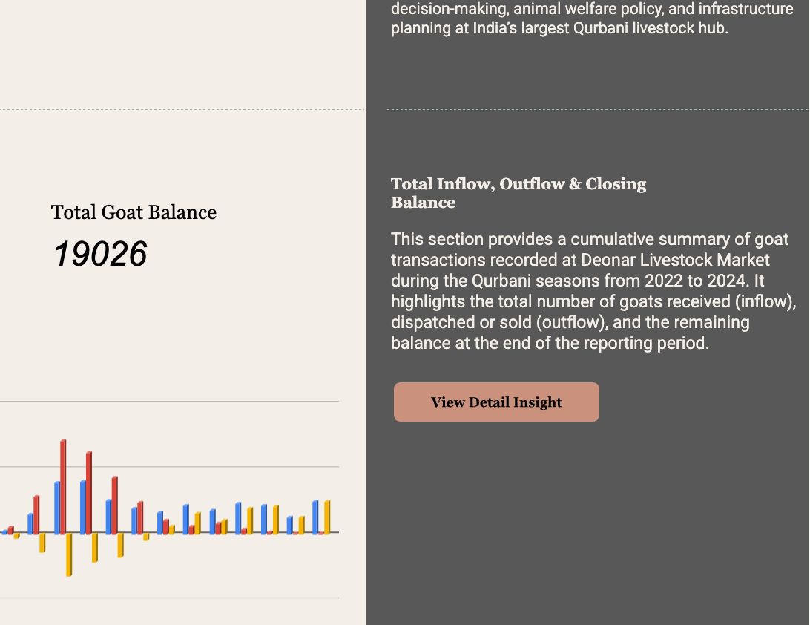

<h1 align="left" style="display: flex; align-items: center;">
  
  Analytics Report — Google Sheets
</h1>

  <strong>End-to-end data analytics pipeline</strong> — from raw data to clean insights — using nothing but <b>Google Sheets</b>.  
  

 

   &nbsp;
   &nbsp;
   &nbsp;
  

 

>[!NOTE]
>
> ## 📊 Preview of Analytics Dashboard 
>
> Below are sample screenshots showcasing the full report view — including data cleaning, visual dashboards, and goat performance metrics, all built using Google Sheets.
>
> 
> 
> 
> 
> 
> 
> 
> 

 

---

> [!IMPORTANT]
> 
> ## Project Overview
> 
> This project showcases the full potential of **Google Sheets** as a powerful, end-to-end data analytics and reporting solution. Key features include:
> 
> - ✅ **Data cleaning & validation** to ensure accuracy and consistency   
> - ✅ **Advanced KPI calculations and data aggregation** for insightful metrics  
> - ✅ **Visually appealing, interactive charts** designed for clear data storytelling  
> - ✅ **Dynamic, auto-updating reports** to effortlessly track goat performance over time  
> 
> Experience a no-code, efficient workflow leveraging only Google Sheets to transform raw data into actionable insights. All done **without using any external code, scripts, or BI tools**.
 
## 🚀 Getting Started

Follow these simple steps to get your analytics up and running:

- **Make a copy** of the Google Sheets file to your own Google Drive.  
- **Use the pre-made tabs**—each tab is dedicated to a specific data category and connected to the main dashboard.

   

- **Click the buttons** inside the sheet to quickly navigate to the related data tabs for easy editing.

   

- **Update the raw data** in these tabs with your own information ensure accuracy for best results.  
-  **Watch the KPIs and dashboards auto-update** in real-time as data changes.  
- **Customize charts** or add your own insights to tailor the report to your needs.  

> [!TIP]
> Make sure to keep your data consistent and formatted properly to avoid calculation errors.

---

## 👨‍💻 Author
For questions or support, reach out to:  

- [@buildwithfiroz](https://github.com/buildwithfiroz)
- buildbyfiroz@icloud.com  